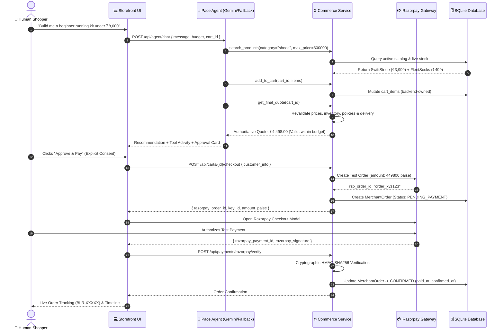
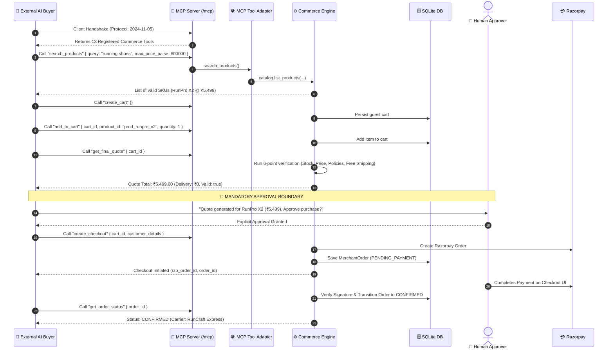

<div align="center">

# 🏃‍♂️ RunCraft — Agentic Commerce Platform

**The AI-Native Commerce Engine with Dual-Agentic Workflows, Model Context Protocol (MCP), and Razorpay Integration**

[](https://fastapi.tiangolo.com)
[](https://react.dev)
[](https://www.typescriptlang.org)
[](https://tailwindcss.com)
[](https://razorpay.com)
[](https://modelcontextprotocol.io)
[](https://ai.google.dev)
[](https://docs.pytest.org)
[](LICENSE)

<p align="center">
  <a href="#-executive-summary">Executive Summary</a> •
  <a href="#-core-architecture">Core Architecture</a> •
  <a href="#-dual-agentic-journeys">Dual Workflows</a> •
  <a href="#-authoritative-commerce-engine">Commerce Engine</a> •
  <a href="#-model-context-protocol-mcp">MCP Adapter</a> •
  <a href="#-razorpay-payments--security">Razorpay & Security</a> •
  <a href="#-evaluator-demo-walkthrough">Evaluator Demo Guide</a> •
  <a href="#-local-setup--quickstart">Quickstart</a> •
  <a href="#-testing--rehearsal-suite">Testing & Rehearsal</a>
</p>

</div>

---

## 🌟 Executive Summary

**RunCraft Agentic Commerce** is an AI-native commerce platform designed to demonstrate how modern e-commerce must evolve for the age of autonomous artificial intelligence.

Traditional e-commerce platforms assume human shoppers browsing static web catalogs. Naive "AI shopping" attempts simply wrap an LLM around a website, leading to hallucinated prices, phantom inventory, unvalidated discounts, and rogue checkout actions. **RunCraft solves this with a strict architectural doctrine:**

> ### 🛡️ The Core Thesis
> **"Agents decide what to do. The commerce layer decides what is true and what is allowed."**
> 
> *Live price, physical stock, promotional discounts, cart totals, delivery fees, merchant selling policies, and payment confirmations must **never** live solely inside an LLM prompt or browser state. The Commerce Service Layer is the sole, authoritative source of truth.*

RunCraft allows a merchant to configure their catalog, inventory, and business rules **once**, then sell simultaneously through two distinct channels:
1. **Journey A (Human Shopper + In-Storefront AI Agent "Pace")**: A human buyer discovers products, negotiates kits within hard budgets, and builds carts conversing with an in-app assistant that executes real backend tools.
2. **Journey B (Autonomous External AI Buyer via Model Context Protocol - MCP)**: External AI agents (e.g. Claude, Gemini, autonomous buyer bots) connect over **Streamable HTTP (`/mcp`)**, dynamically discover commerce tools, assemble carts, receive cryptographic quotes, and checkout autonomously with human-in-the-loop approval.

---

## 📐 Core Architecture

RunCraft is built as a clean, decoupled **two-tier architecture** with persistent local SQLite storage. There are no cloud dependencies, external databases, or microservice overhead.

```
┌─────────────────────────────────────────────────────────────────────────────┐
│                           PRESENTATION TIER                                 │
│                                                                             │
│   🛒 Modern Storefront            💬 In-App Assistant ("Pace")              │
│   • Product Catalog & Filters     • Conversational Kit Builder              │
│   • Product Detail & Specs        • Hard Budget Constraint Enforcer         │
│   • Backend-Synced Cart Drawer    • Live Tool Activity Visualizer           │
│   • Guest & Session Checkout      • Authoritative Approval Card             │
│                                                                             │
│   🛠️ Merchant Admin Portal        🤖 External AI Buyer Console              │
│   • Live Catalog CRUD + Uploads   • Real-Time MCP Tool Discovery            │
│   • Business Policy Configurator  • Autonomous Agent Multi-Turn Run         │
│   • Order Lifecycle Management    • JSON-RPC Wire Inspector & Audit Logs    │
│   • Real-Time SQL Analytics       • Interactive Tool Sandbox                │
└──────────────────────────────────────┬──────────────────────────────────────┘
                                       │ REST / JSON + MCP Streamable HTTP
                                       ▼
┌─────────────────────────────────────────────────────────────────────────────┐
│                         FASTAPI BACKEND TIER                                │
│                                                                             │
│   [ Transport & Protocol Layer ]                                            │
│   ├── REST API Routers (/api/products, /api/carts, /api/orders, /api/admin) │
│   ├── Agent Router (/api/agent/chat, /api/agent/tools/*)                    │
│   └── MCP Streamable HTTP ASGI Server (/mcp)                                │
│                                                                             │
│   [ Agent Intelligence Layer ]                                              │
│   ├── Google Gemini 2.5 Flash (Structured Function Calling)                 │
│   └── Deterministic Fallback Orchestrator (100% Offline Hackathon Guarantee)│
│                                                                             │
│   [ Authoritative Commerce Service Layer ]                                  │
│   ├── Catalog & Dynamic Inventory Service                                   │
│   ├── Authoritative Real-Time Quote Engine (Price/Stock/Policy Revalidation)│
│   ├── Cart Service (Session-Scoped, Backend-Owned)                          │
│   ├── Merchant Policy Engine (Max Discount, Stock Rules, Cross-Sells)       │
│   ├── Order Lifecycle & Fulfillment Service (CONFIRMED -> DELIVERED)        │
│   ├── Payment Service (Razorpay Test Mode, HMAC Signature Verification)     │
│   ├── Idempotent Webhook Engine (Replay Protection via ProcessedEvent Log)  │
│   ├── Real-Time SQL Analytics Engine                                        │
│   └── Immutable Audit Trail Logger                                          │
└──────────────────────────────────────┬──────────────────────────────────────┘
                                       │ SQLAlchemy 2.0 ORM
                                       ▼
┌─────────────────────────────────────────────────────────────────────────────┐
│                        PERSISTENCE & SECURITY                               │
│                                                                             │
│   🗄️ Local SQLite Engine (`backend/data/store.db`)                          │
│   ├── merchants              ├── carts & cart_items                         │
│   ├── admin_users            ├── merchant_orders & payment_attempts         │
│   ├── products & skus        ├── processed_webhook_events                   │
│   └── merchant_policies      └── audit_events                               │
│                                                                             │
│   🔐 Cryptographic Security Boundary                                        │
│   • Server-Side Razorpay Secret Key Isolation                               │
│   • HMAC-SHA256 Signature Verification: order_id + "|" + payment_id         │
│   • Webhook Signature Validation (`X-Razorpay-Signature`)                   │
│   • Integer Paise Math Throughout (Zero Floating-Point Imprecision)         │
└─────────────────────────────────────────────────────────────────────────────┘
```

---

## 🔄 Dual Agentic Journeys

### Journey A: In-Storefront AI Assistant ("Pace")



### Journey B: Autonomous External AI Buyer via MCP



---

## ⚙️ Authoritative Commerce Engine

### 1. The 6-Point Authoritative Quote Engine (`get_final_quote`)
The quote engine is the central commercial arbiter. An item in a cart is merely an intention; **the quote is the binding commercial contract**. Whenever `get_final_quote()` is executed:
1. **Live SKU Existence & Activation**: Verifies that every product is still active and exists in the merchant's catalog.
2. **Real-Time Price Snapshotting**: Compares the unit price when the product was added against the current live price. If an admin updated the price in the background, the quote recalculates using the *authoritative current price*.
3. **Physical Inventory Verification**: Checks live SQLite stock. If requested quantity exceeds remaining inventory, the quote is marked `valid: false` with an explicit reason (`INSUFFICIENT_STOCK`).
4. **Merchant Policy Validation**: Enforces merchant-configured rules:
   - Cap maximum discount percentage (e.g., maximum 15%).
   - Out-of-stock ordering prohibition.
   - Mandatory human approval flag.
5. **Cross-Sell Policy Triggering**: Automatically inspects policy rules (e.g., *Purchasing shoes recommends Fleet Anti-Blister Socks*) and surfaces contextual recommendations.
6. **Dynamic Delivery Fee Calculation**: Applies real-time merchant shipping tiers:
   - Free shipping for orders $\ge$ ₹1,500.
   - Standard flat fee (₹150) for orders $<$ ₹1,500.

### 2. State Machine: Order & Payment Lifecycle

```text
               ┌───────────────────────┐
               │    Cart Created       │
               └──────────┬────────────┘
                          │ Items added & quote verified
                          ▼
               ┌───────────────────────┐
               │   Checkout Initiated  │
               └──────────┬────────────┘
                          │ Razorpay order created
                          ▼
               ┌───────────────────────┐
               │    PENDING_PAYMENT    │◄────────────────────────┐
               └──────────┬────────────┘                         │
                          │                                      │
            ┌─────────────┴─────────────┐                        │
  Payment   │ Signature Verified /      │ Payment Failed /       │ Retry Payment
  Succeeded │ Webhook `order.paid`      │ Webhook `pay.failed`   │ (Same Order!)
            ▼                           ▼                        │
     ┌─────────────┐             ┌─────────────┐                 │
     │    PAID     │             │ PAYMENT     │─────────────────┘
     └──────┬──────┘             │ FAILED      │
            │ Confirmation Logic └─────────────┘
            ▼
     ┌─────────────┐
     │  CONFIRMED  │ (Inventory decremented, audit logged)
     └──────┬──────┘
            │ Admin marks in fulfillment
            ▼
     ┌─────────────┐
     │ PROCESSING  │
     └──────┬──────┘
            │ Shipped with carrier (e.g. RunCraft Express: BLR-47653)
            ▼
     ┌─────────────┐
     │   SHIPPED   │
     └──────┬──────┘
            │ Final delivery confirmation
            ▼
     ┌─────────────┐
     │  DELIVERED  │
     └─────────────┘
```

> ⚠️ **Key Architectural Guarantee**: When a payment fails, **no duplicate merchant order is created**. The system preserves the original merchant order and allows the user to retry payment against the existing record.

---

## 🔌 Model Context Protocol (MCP)

RunCraft provides a native **Model Context Protocol (MCP)** adapter running over **Streamable HTTP** (`http://127.0.0.1:8000/mcp`), implementing the 2024-11-05 MCP specification. 

External AI agents connect directly to this endpoint without custom APIs. All MCP tools are **thin wrappers** that execute the same underlying commerce services as the REST API, ensuring 100% parity across channels.

### Registered MCP Tool Registry

| Tool Name | Parameters | Description |
| :--- | :--- | :--- |
| `search_products` | `query`, `category`, `max_price_paise` | Search active products with keyword, category, or maximum budget filter. |
| `get_product` | `product_id` | Retrieve complete technical specs, live price, and stock for a SKU. |
| `check_inventory` | `product_id`, `quantity` | Real-time physical inventory availability check. |
| `get_related_products` | `product_id` | Get merchant cross-sell recommendations (e.g. shoes $\to$ socks). |
| `get_offers` | `cart_id` | Check eligible promotional discounts against merchant policies. |
| `create_cart` | `session_id` | Initialize an authoritative backend-owned guest shopping cart. |
| `add_to_cart` | `cart_id`, `product_id`, `quantity` | Add an item to the authoritative cart. |
| `remove_from_cart` | `cart_id`, `product_id` | Remove an item from the cart. |
| `get_cart` | `cart_id` | Retrieve current cart items, quantities, and subtotal. |
| `get_final_quote` | `cart_id` | **Mandatory Pre-Checkout**: 6-point price, inventory, and policy revalidation. |
| `create_checkout` | `cart_id`, `customer_name`, `email`, `phone`, `shipping_address` | Lock quote, generate Razorpay order, and create `PENDING_PAYMENT` order. |
| `get_order` | `order_id` | Retrieve full order details, snapshot line items, and fulfillment state. |
| `get_order_status` | `order_id` | Fetch live tracking number, carrier name, and fulfillment timeline. |

### Built-In External AI Buyer Simulation Console (`/external-buyer`)
For evaluators who do not have an external MCP client running locally, RunCraft includes a **complete built-in simulator**:
- **Live Tool Discovery**: Fetches registered tools directly from `/api/mcp/tools`.
- **Autonomous AI Workflow Turn**: Runs a full autonomous buyer loop with real tool invocations.
- **Wire Inspector**: Visualizes the raw JSON-RPC 2.0 payloads exchanged between the agent and the server.
- **Interactive Tool Sandbox**: Allows evaluators to hand-craft JSON arguments and invoke any tool directly.

---

## 🤖 Dual-Engine In-App Assistant ("Pace")

The in-app assistant "Pace" features an intelligent **Dual-Engine Architecture**:
1. **Google Gemini 2.5 Flash Engine**: When `GEMINI_API_KEY` is configured, Pace uses Gemini 2.5 function calling to translate natural user dialogue into structured tool calls against the unified tool executor.
2. **Deterministic Fallback Orchestrator**: When no API key is supplied or if network issues occur, Pace automatically falls back to an offline rule-based orchestrator. It parses budgets, searches the live catalog, cross-sells related gear, and generates authoritative quotes with **zero external dependencies**.

This dual-engine guarantee ensures that evaluators will **never experience a broken demo** due to external API quotas or expired keys.

---

## 💳 Razorpay Payments & Security

RunCraft implements a **zero-trust payment architecture**:

1. **Client-Side Secret Isolation**: `RAZORPAY_KEY_SECRET` never leaves the FastAPI backend. The frontend only ever receives the public `RAZORPAY_KEY_ID` and a server-generated `razorpay_order_id`.
2. **Server-Side Order Generation**: Razorpay orders are created via the official Razorpay SDK using integer amounts in paise calculated exclusively by the backend quote engine.
3. **Cryptographic Signature Verification**:
   ```python
   # HMAC-SHA256 signature verification on backend
   generated_signature = hmac.new(
       key=settings.RAZORPAY_KEY_SECRET.encode("utf-8"),
       msg=f"{razorpay_order_id}|{razorpay_payment_id}".encode("utf-8"),
       digestmod=hashlib.sha256
   ).hexdigest()
   
   if not hmac.compare_digest(generated_signature, razorpay_signature):
       raise PaymentVerificationError("Invalid cryptographic payment signature")
   ```
4. **Idempotent Webhook Processing**:
   - Webhook payloads received at `/api/payments/razorpay/webhook` are cryptographically verified against `RAZORPAY_WEBHOOK_SECRET`.
   - Every event ID is recorded in the `processed_webhook_events` table.
   - Replayed or duplicate webhooks are acknowledged immediately (`200 OK`) without triggering duplicate state transitions or inventory mutations.
5. **Human-in-the-Loop Approval Boundary**:
   - Even when an autonomous AI agent prepares a checkout, the platform **strictly halts** execution and demands explicit human approval before invoking the payment gateway.

---

## 🛠️ Merchant Admin Portal

The Admin Portal (`/admin`) provides full visibility and control over the commerce engine:

- **📊 Commerce Analytics**: Real-time SQL aggregation of Gross Merchandise Value (GMV), Total Orders, Average Order Value (AOV), Conversion Rates, Channel Breakdown (Storefront vs External MCP), and Cross-Sell Uptake.
- **📦 Catalog Management**:
  - Add new SKUs with custom SKU codes, categories, descriptions, price in paise, and stock counts.
  - **Multipart Image Upload**: Direct image file upload stored under `backend/data/uploads/products/` and served locally.
  - Live stock adjustment and instant catalog activation/deactivation.
- **📜 Policy Engine Configurator**:
  - Set global maximum discount percentage cap (e.g. 15%).
  - Toggle out-of-stock ordering permission.
  - Toggle mandatory human approval requirement for AI buyers.
  - Configure dynamic cross-sell association rules (e.g. SKU A $\to$ SKU B).
  - Define free delivery threshold and standard delivery fees.
- **🚚 Order Fulfillment & Carrier Tracking**:
  - View all orders across storefront and external MCP channels.
  - Advance orders through fulfillment stages: `CONFIRMED` $\to$ `PROCESSING` $\to$ `SHIPPED` $\to$ `DELIVERED`.
  - Assign tracking numbers (e.g., `BLR-94821`) and carrier details (e.g., `RunCraft Express`).
- **🌐 Channel Management**: Real-time health status of both storefront web client and MCP Streamable HTTP endpoint.

---

## 🚀 Local Setup & Quickstart

### Prerequisites
- **Python 3.12+** (Python 3.13 fully supported)
- **Node.js 20+** and `npm`
- `uv` (recommended for ultra-fast Python setup) or standard `pip`

---

### Option A: One-Command Startup (Windows PowerShell)

From the project root:
```powershell
.\run-local.ps1
```
This automatically launches both the FastAPI backend (`http://127.0.0.1:8000`) and the Vite React frontend (`http://localhost:5173`) in dedicated PowerShell windows.

---

### Option B: Manual Setup (Step-by-Step)

#### 1. Configure Environment Variables
From the repository root:
```bash
cp .env.example .env
```
*(The default `.env` is pre-configured with demo secrets and local SQLite settings.)*

#### 2. Backend Setup
```bash
cd backend

# Create virtual environment and install dependencies
uv venv
# Windows: .venv\Scripts\activate
# macOS/Linux: source .venv/bin/activate
uv pip install -e .

# Run database migrations
alembic upgrade head

# Deterministically seed catalog, merchant policies, and demo data
python -m app.db.seed

# Start FastAPI server
uvicorn app.main:app --reload --port 8000
```
- **Backend API**: `http://127.0.0.1:8000`
- **Interactive Swagger Docs**: `http://127.0.0.1:8000/docs`
- **MCP Streamable HTTP Endpoint**: `http://127.0.0.1:8000/mcp`

#### 3. Frontend Setup
In a separate terminal window:
```bash
cd frontend
npm install
npm run dev
```
- **Storefront Application**: `http://localhost:5173`
- **Admin Portal**: `http://localhost:5173/admin`
- **External AI Buyer Console**: `http://localhost:5173/external-buyer`

---

### 🔑 Demo Admin Credentials

| Role | Email | Password |
| :--- | :--- | :--- |
| **Merchant Admin** | `admin@runcraft.internal` | `demosecret123` |

---

## 🧪 Evaluator Demo Walkthrough

Follow these 5 scenarios to evaluate every layer of the platform in under 10 minutes:

### Scenario 1: Admin Adds a SKU & Syncs Instantly to Storefront
1. Go to `http://localhost:5173/admin/login` and log in with demo credentials (`admin@runcraft.internal` / `demosecret123`).
2. Navigate to **Catalog** $\to$ **Add Product**.
3. Create a new SKU:
   - Name: `RunCraft StormShield Jacket`
   - SKU: `APP-STORM-JKT-L`
   - Category: `Running Apparel`
   - Price: `₹3,499.00`
   - Stock: `25`
   - Upload an image or use an Unsplash URL.
4. Click **Save Product**.
5. Switch to `http://localhost:5173/shop`. Notice the new product appears **immediately** in the storefront catalog without any code restart.

### Scenario 2: Shopping with In-App Assistant "Pace" (Hard Budget Kit)
1. Open the Storefront at `http://localhost:5173` and click **Shop with AI** (or navigate to `/assistant`).
2. Type or select the quick prompt:
   > *"Build me a beginner running kit under ₹8,000"*
3. Observe **Pace** executing real backend tools:
   - Tool Activity shows `search_products` with budget constraint `₹8,000`.
   - Recommends `RunPro X2 Road Runner` (₹5,499) + `Fleet Anti-Blister Running Socks` (₹499).
   - Shows live product cards with "Add to Kit".
4. Say: *"Add the kit to my cart and prepare quote"*.
5. Observe the **Authoritative Approval Card** appearing in chat:
   - Total revalidated: `₹5,998.00` (within budget).
   - Free shipping applied.
6. Click **Proceed to Checkout**.

### Scenario 3: Complete Razorpay Test Payment & Verify Confirmation
1. In checkout, review the authoritative quote and fill test contact info.
2. Click **Approve & Pay ₹5,998.00**.
3. The real **Razorpay Checkout modal** launches.
4. Use standard Razorpay Test details:
   - Phone: `9876543210`
   - Payment method: **UPI / Netbanking / Card** (select "Success").
5. The backend verifies the cryptographic HMAC signature.
6. Order transitions to `CONFIRMED`.
7. You are redirected to `/orders/:orderId` with a live delivery progress timeline and tracking number.

### Scenario 4: Machine-to-Machine External AI Buyer over MCP
1. Navigate to `http://localhost:5173/external-buyer`.
2. Review the **Registered MCP Tools** (all 13 tools loaded from `/mcp`).
3. Click **Run Autonomous Buyer Workflow** with prompt:
   > *"Find beginner running shoes under ₹6,000 and prepare my quote for checkout"*
4. Watch the autonomous agent perform multi-turn MCP tool calls:
   - `search_products` $\to$ `create_cart` $\to$ `add_to_cart` $\to$ `get_final_quote`.
5. View the raw **JSON-RPC 2.0 Wire Calls** log.
6. Notice execution **pauses at the Mandatory Human Approval Boundary**.
7. Click **Authorize & Complete Checkout**.
8. The order is created and verified via Razorpay through the external buyer channel!

### Scenario 5: Order Fulfillment & Admin Analytics
1. Go back to `/admin/orders`.
2. Open the order created by the external buyer or storefront.
3. Advance status: `CONFIRMED` $\to$ `PROCESSING` $\to$ `SHIPPED`.
4. Enter tracking carrier `RunCraft Express` and tracking number `BLR-88412`.
5. Return to `/orders` as a customer to see the live timeline update in real time.
6. Visit `/admin/dashboard` to inspect updated revenue, AOV, and channel split metrics.

---

## 🧪 Testing & Rehearsal Suite

RunCraft includes an automated test and rehearsal suite ensuring zero regressions:

### 1. Run Automated Pytest Suite (101 Tests)
```bash
cd backend
uv run pytest
```
```text
============================= test session starts =============================
collected 101 items

tests/test_admin_analytics.py ........                                   [  7%]
tests/test_demo_seed.py ......                                           [ 13%]
tests/test_error_states.py .......                                       [ 20%]
tests/test_external_buyer.py .....                                       [ 25%]
tests/test_mcp_tools.py .........                                        [ 34%]
tests/test_mcp_wire.py .                                                 [ 35%]
tests/test_phase0.py ....                                                [ 39%]
tests/test_phase3_commerce.py .......                                    [ 46%]
tests/test_phase4_agent.py ...........                                   [ 57%]
tests/test_phase5_payment.py ...................                         [ 76%]
tests/test_phase6_orders.py .......................                      [ 99%]
tests/test_rehearsal.py .                                                [100%]

======================= 101 passed in 70.50s (0:01:10) ========================
```

### 2. Run Deterministic End-to-End Demo Rehearsal
To run a comprehensive verification of all 11 stages of the hackathon lifecycle in one execution:
```bash
cd backend
python -m app.demo.rehearsal
```
**Rehearsal Checkpoints Verified:**
- `[PASS] Stage A`: Storefront Shopping & Stock Availability
- `[PASS] Stage B`: In-App Agent Multi-Turn Discovery & Budget Constraint
- `[PASS] Stage C`: External AI Buyer + MCP Streamable HTTP Adapter
- `[PASS] Stage D`: Human-in-the-Loop Purchase Approval Boundary
- `[PASS] Stage E`: Razorpay Test Mode Payment Initiation
- `[PASS] Stage F`: HMAC Signature Verification & Order Confirmation
- `[PASS] Stage G`: Admin Order Fulfillment Lifecycle (`CONFIRMED` $\to$ `DELIVERED`)
- `[PASS] Stage H`: Customer Order Tracking & Session Scoping
- `[PASS] Stage I`: Immutable Audit Trail Logging
- `[PASS] Stage J`: Real-Time SQL Analytics Computation
- `[PASS] Stage K`: Error Recovery & Payment Retry Idempotency

---

## 📂 Project Directory Structure

```text
Razorpay1/
├── AGENTS.md                      # AI build discipline & architectural rules
├── README.md                      # Primary project documentation (you are here)
├── run-local.ps1                  # One-command dual-service Windows launcher
├── .env.example                   # Environment configuration template
│
├── context/                       # Specification & design documents
│   ├── project-overview.md        # MVP PRD and user personas
│   ├── architecture.md            # Architectural decisions & state machines
│   ├── build-plan.md              # 8-phase implementation roadmap
│   ├── ui-rules.md                # UI component guidelines
│   └── ui-tokens.md               # Theme and color token definitions
│
├── backend/                       # FastAPI Backend Application
│   ├── pyproject.toml             # Python dependencies & build config
│   ├── alembic.ini                # Alembic database migration config
│   ├── alembic/                   # Database version migration scripts
│   ├── data/                      # Local SQLite storage (`store.db`) & uploads
│   ├── app/
│   │   ├── main.py                # FastAPI app initialization, CORS & MCP mount
│   │   ├── core/                  # Configuration, security, CORS & tokens
│   │   ├── db/                    # SQLAlchemy engine, base & seed script
│   │   ├── models/                # Authoritative SQLAlchemy models
│   │   │   ├── merchant.py        # Merchant entity
│   │   │   ├── admin_user.py      # Admin credentials & roles
│   │   │   ├── product.py         # Products & SKU inventory
│   │   │   ├── policy.py          # Merchant policy rules
│   │   │   ├── cart.py            # Carts & cart items
│   │   │   ├── order.py           # Merchant orders & address snapshots
│   │   │   ├── payment.py         # Payment attempts & provider status
│   │   │   ├── webhook_event.py   # Idempotent webhook event ledger
│   │   │   └── audit.py           # Immutable audit log entries
│   │   ├── schemas/               # Pydantic v2 request/response schemas
│   │   ├── services/              # Authoritative commerce business logic
│   │   │   ├── catalog.py         # Product search & stock queries
│   │   │   ├── cart.py            # Cart CRUD & session binding
│   │   │   ├── quote.py           # 6-point authoritative quote engine
│   │   │   ├── policy.py          # Merchant policy enforcement
│   │   │   ├── payment.py         # Razorpay checkout & signature verification
│   │   │   ├── orders.py          # Order state machine & tracking updates
│   │   │   ├── analytics.py       # Real-time SQL aggregation metrics
│   │   │   ├── audit.py           # Audit event logger
│   │   │   ├── agent.py           # Agent orchestrator entrypoint
│   │   │   ├── agent_tools.py     # Unified tool executor (shared by REST/MCP)
│   │   │   ├── agent_fallback.py  # Deterministic fallback engine
│   │   │   └── external_buyer.py  # External AI buyer simulation service
│   │   ├── api/routes/            # REST API route handlers
│   │   ├── integrations/          # External gateway wrappers (Razorpay, Gemini)
│   │   ├── mcp/                   # Model Context Protocol Streamable HTTP server
│   │   │   ├── server.py          # ASGI MCP streamable HTTP factory
│   │   │   └── tools.py           # 13 registered MCP commerce tools
│   │   └── demo/                  # Rehearsal runner (`rehearsal.py`)
│   └── tests/                     # 101 automated pytest test suites
│
└── frontend/                      # React 19 + Vite + TypeScript Frontend
    ├── package.json               # Frontend dependencies & scripts
    ├── vite.config.ts             # Vite configuration with Tailwind CSS v4
    └── src/
        ├── App.tsx                # Main routing shell & query provider
        ├── components/
        │   ├── layout/            # AppShell, AdminShell, Header, Footer, CartDrawer
        │   ├── storefront/        # Hero, ProductGrid, ProductCard, TrustSection
        │   ├── assistant/         # AssistantPanel, ChatMessage, ApprovalCard
        │   ├── checkout/          # CheckoutForm, CartSummary
        │   ├── orders/            # OrderTimeline, TrackingCard
        │   ├── admin/             # SkuForm, AdminProtectedRoute
        │   └── ui/                # Button, Badge, Card, Input, Modal, Toast
        ├── pages/
        │   ├── client/            # ShopPage, ProductDetail, Cart, Checkout, Orders
        │   │   └── ExternalBuyerPage.tsx  # Interactive MCP AI Buyer Simulator
        │   └── admin/             # Dashboard, Catalog, Orders, Policies, Channels
        ├── lib/
        │   ├── api/client.ts      # Typed backend API client
        │   └── razorpay.ts        # Dynamic Razorpay Checkout SDK loader
        └── types/                 # TypeScript domain and Razorpay interfaces
```

---

## 🏆 Summary of Hackathon Evaluation Highlights

| Feature | Naive LLM Approach | RunCraft Implementation |
| :--- | :--- | :--- |
| **Pricing & Inventory** | LLM hallucinates prices from outdated training data | Authoritative SQLite database checked in real time |
| **Quote Calculation** | LLM adds numbers via text generation | 6-point backend quote engine revalidating prices and policies |
| **Payment Trigger** | Agent autonomously attempts credit card charges | Strict Human-in-the-Loop Approval boundary |
| **External Agent Support** | Requires proprietary agent-to-agent protocols | Official Model Context Protocol (MCP) over Streamable HTTP |
| **Payment Gateway** | Fake/mocked frontend-only payment dialog | Real Razorpay Test Mode with server-side HMAC verification |
| **Payment Failure** | Creates duplicate orders upon retry | Reuses original merchant order with idempotent state tracking |
| **Fulfillment Tracking** | Static dummy text | Real admin fulfillment pipeline with carrier tracking numbers |
| **Evaluation Resilience** | Breaks when external LLM rate limits or fails | Dual-engine: Gemini 2.5 Flash + Deterministic Fallback |

---

<div align="center">
  <b>RunCraft Agentic Commerce MVP</b> — Engineered with precision for the hackathon evaluation.
</div>
